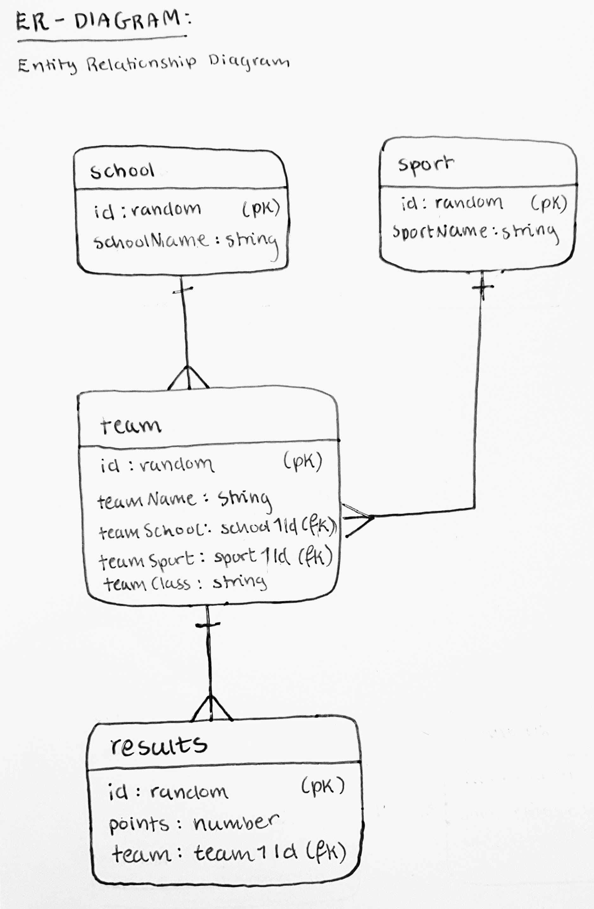

# idrettsdag
## datamodell

Én skole har flere lag;
Én idrett har flere lag;
Ett lag har flere resultater.
 
Primærnøklene i skoledatabasen og idrettsdatabasen brukes som fremmednøkkel i lagdatabasen, og primærnøkkelen i lagdatabasen brukes som fremmednøkkel i resultatdatabasen.
